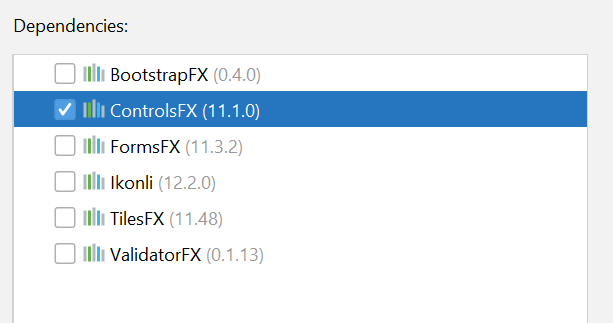

# Come usare i controlli aggiuntivi per JavaFX

Esistono una serie di librerie aggiuntive che aumentano il numero 
di controlli grafici utilizzabili all'interno delle nostre interfacce
e che IntelliJ è in grado di inserire nel progetto.

Per far questo è sufficiente, nelle schermate di creazione del progetto,
selezionare la/e libreria/e che si vuole aggiungere, come
mostrato nell'immagine qua sotto, relativa alla libreria 
[ControlsFX](https://github.com/controlsfx/controlsfx).

Una volta fatto questo nel progetto sarà possibile aggiungere
i controlli che interessano, ma cosa fare per poter aggiungere
i nuovi componenti utilizzando lo Scene Builder per la costruzione
dell'interfaccia grafica? Scene Builder è in grado di integrare nella
propria interfaccia i nuovi componenti, basta seguire quanto esposto 
alla [seguente pagina](https://stackoverflow.com/a/29602003), che 
si trova anche in [questo PDF](javafx_Include_ControlsFX_in_Scene_Builder_Stack_Overflow.pdf).

A questo punto si potranno inserire i controlli desiderati, nell'esempio di questo
progetto un SearchableComboBox, e lavorare come con i normali controlli di JavaFX.
